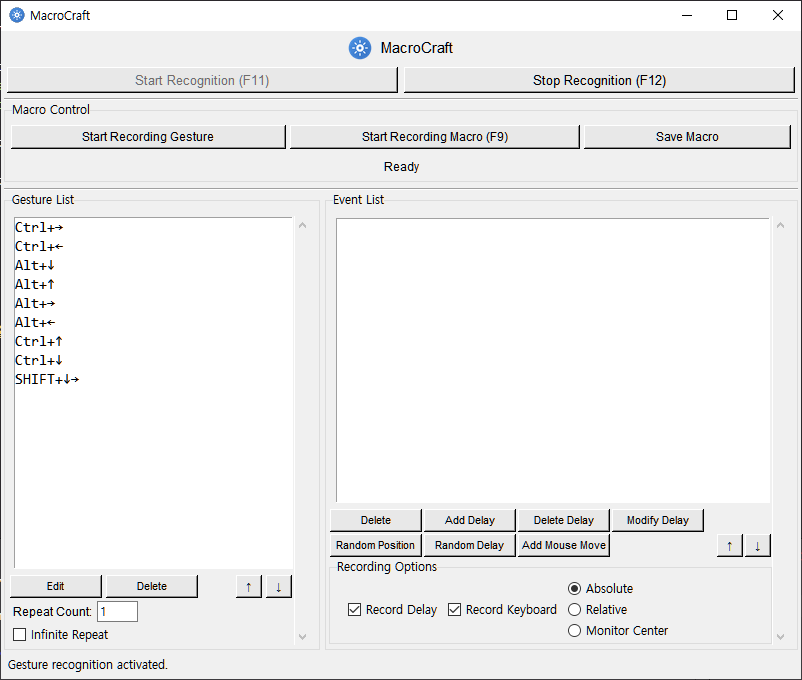

# MacroCraft ⌨️🖱️✨

MacroCraft is a powerful macro program that allows you to automate repetitive tasks by precisely recording and editing keyboard and mouse inputs. 🛠️ It offers an intuitive interface to manage recorded events and provides various execution options.

## Quick Links 🔗

- [⬇️ Download Latest Release](https://github.com/htpaak/MacroCraft/releases/latest)
- [⭐ GitHub Repository](https://github.com/htpaak/MacroCraft)
- [💬 Feedback & Discussion](https://github.com/htpaak/MacroCraft/discussions)

## Key Features 🌟

- **🖱️⌨️ Versatile Input Recording**: Records almost all user input events, including keyboard inputs (key press, release), mouse clicks (left, right, wheel click), mouse movements, and mouse wheel scrolls.
- **✏️ Powerful Editing Features**: Allows selecting individual events from the recorded event list to delete, duplicate, or add delays at desired positions. Also supports changing event properties (e.g., coordinates, keys).
- **🎲 Random Coordinates and Delays**: Supports adding random values to mouse click/move coordinates or delays between events to avoid detection patterns during macro execution.
- **🗺️ Absolute/Relative Coordinate Support**: Choose to record mouse move and click events using absolute coordinates (screen-wide) or relative coordinates (based on the current window position) for flexible response to window position changes.
- **⏯️ Real-time Recording/Playback Control**: Instantly control macro recording start/stop and saved macro execution/stop using hotkeys or GUI buttons.
- **🔄 Repeat Execution Options**: Set the macro to repeat a desired number of times or loop indefinitely until stopped.
- **⚙️ Customizable Recording Settings**: Users can choose whether to record mouse movement events, keyboard inputs, and the coordinate mode (absolute/relative).
- **🚀 System Tray Integration**: Minimize the program to a system tray icon to run in the background.

## Demo 📸

<!-- *(Additional screenshots to be added later)* -->
<!--  -->

## System Requirements 💻

- Windows Operating System (7/8/10/11)
- Some available disk space 💾

## Installation (Executable) 🚀

1.  Go to the [Releases page](https://github.com/htpaak/MacroCraft/releases/latest).
2.  Download the `MacroCraft_vX.Y.Z.exe` file (where X.Y.Z is the version number).
3.  That's it! No installation needed. Simply run the downloaded `.exe` file.
4.  Launch MacroCraft and start automating your tasks! 🎉

## How to Use 📖

1.  **Record Macro:**
    *   In 'Recording Settings', configure whether to record mouse movement, keyboard input, and the coordinate mode.
    *   Press the 'Start Recording' button (or `F9`) to begin recording.
    *   Perform the keyboard and mouse actions you want to automate.
    *   Press the 'Stop Recording' button (or `F9`) to end the recording.
2.  **Edit Events:**
    *   Select the event to edit from the 'Event List' in the center.
    *   Use the 'Editing Tools' on the right or the 'Edit' menu at the top to delete, duplicate events, or add delays.
3.  **Save and Load Macro:**
    *   Once editing is complete, press the 'Save Macro' button, specify a name, and save.
    *   Saved macros are displayed in the 'Macro List' on the right.
4.  **Execute Macro:**
    *   Set the 'Repeat Count' or check 'Infinite Repeat'.
    *   Press the 'Execute' button (or `F11`) to run the macro.
    *   A running macro can be stopped with the 'Stop' button (or `F12`).
    *   You can also draw a registered gesture on the screen to execute the corresponding macro (when gesture functionality is enabled).

## Main Module Structure 📦

-   `main.py`: Application entry point, initializes all modules and runs the GUI
-   `gui.py`: Tkinter-based user interface logic
-   `recorder.py`: Handles keyboard/mouse event recording
-   `player.py`: Handles playback of recorded macro events
-   `editor.py`: Provides macro event editing features
-   `storage.py`: Handles saving and loading macro files
-   `gesture_manager.py`: Manages mouse gesture recognition and processing (Beta)
-   `tray_manager.py`: Manages system tray icon and menu (Beta)
-   `*_list.py`, `*_editor.py`, etc.: Manage specific sections of the GUI

## Development Information 👨‍💻

Key technologies used:
-   Python 3.x 🐍
-   Tkinter (GUI) 🎨
-   keyboard library (Keyboard event hooking/control)
-   mouse library (Mouse event hooking/control)

## Acknowledgements 🙏

-   Thanks to everyone who helped develop MacroCraft! 💖
-   Thanks to the open-source libraries that made this project possible!
